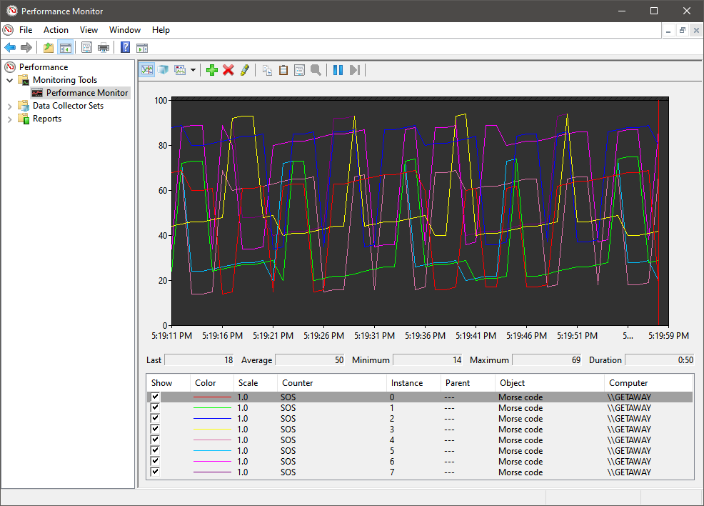
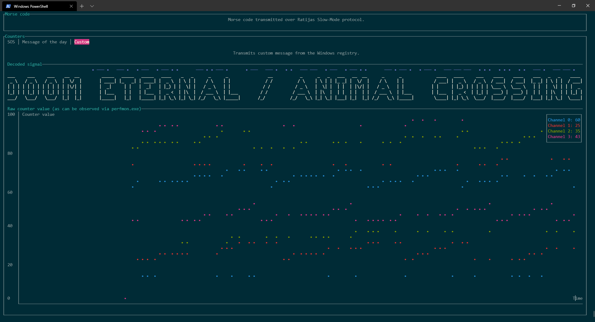
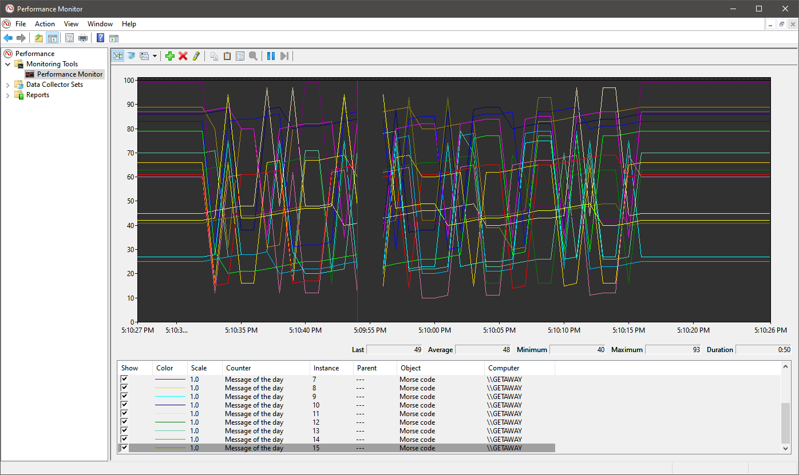
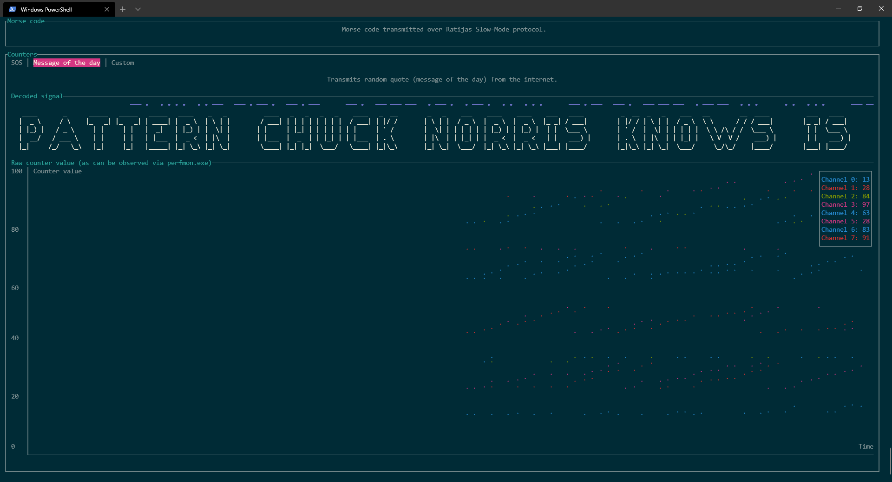
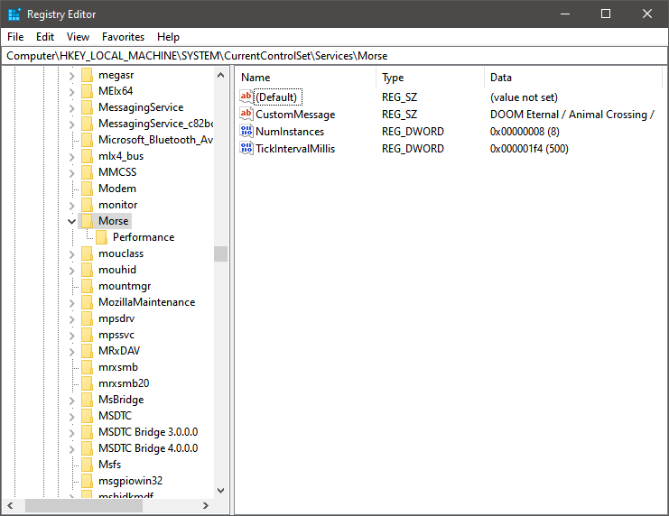

# Windows performance counters in Rust

This all started as a simple university assignment on building a custom Windows
performance counters object provider in C++. Guess what? Now it is in Rust.
And it's not merely a simple counter, but a framework for building them.

# Windows + Rust = <3

This is an __umbrella project__ for libs and tools used to build Windows
performance counters provider and consumer which exchange text data through
Morse code additionally encoded with custom protocol for robustness and
synchronization.

Cargo workspace includes the following sub-projects (highest to lowest importance):

| Target                        | Path                             | Description                                                                                                        |
|-------------------------------|----------------------------------|--------------------------------------------------------------------------------------------------------------------|
| example-provide-morse-counter | examples.d/provide-morse-counter | Compile and install and register dll which provides "Morse code" performance counters object.                      |
| example-consume-morse-counter | examples.d/consume-morse-counter | Terminal user interface (TUI) for consumer of "Morse code" performance counters object.                            |
| win-high                      | win-high/                        | High-level safe bindings and wrappers for the winapi.                                                              |
| win-low                       | win-low/                         | Low-level bindings for winapi which are missing from the winapi crate.                                             |
| signal-flow                   | signal-flow/                     | Tx/Rx abstractions and common useful implementations. Provides blocking senders and receivers.                     |
| morse-stream                  | morse-stream/                    | Streaming encoder and decoder of Morse code. Supports ITU dialect with most of punctuation included.               |
| rtsm-proto                    | rtsm-proto/                      |  Ratijas Slow-Mode protocol, designed to prevent synchronization problems, built on top of signal-flow primitives. |

Several examples are contained in a separate project. This is done to
facilitate dependency management of the examples.

# Check this out

To install provider and test it with consumer:

1. `> cargo build --package example-provide-morse-counter`
2. Install script copies debug target. To use release instead, change path
    manually in the `scripts/install.bat`.
    * Right-click `install.bat`, 'Run as Administrator'.
    * Or run `examples.d\provide-morse-counter\scripts\install.bat` from the
    administrator's console.
3. Open "Registry Editor" (Press Win+R, type "regedit.exe" then hit Enter).
4. Navigate to `HKEY_LOCAL_MACHINE\SYSTEM\CurrentControlSet\Services\Morse`.
5. Customize message, number of instances (0xffffffff for no instances) and
    tick interval in milliseconds to your liking.
     
    To test it performance monitor, tick interval should be at least a little
    more than a second to prevent accidental skips.
6. Open "Performance Monitor" (Win+R "perfmon.exe"), add counter object named
    "Morse code".
7. `> cargo run --bin example-consume-morse-counter` WITHOUT administrator
    privileges.

# Gallery

 
_SOS in Performance Monitor_

 
_Custom message_

 
_Message of the day in Performance Monitor_

 
_Random joke about CHUCK NORRIS_

 
_RegEdit.exe settings_
